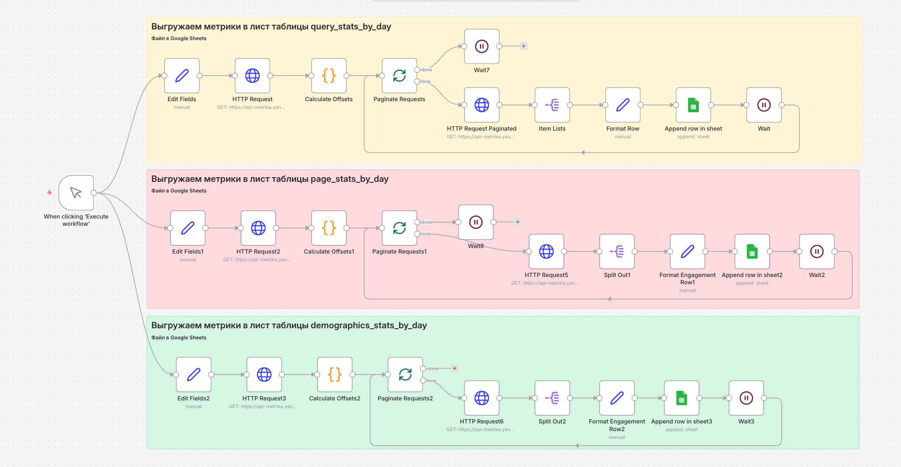
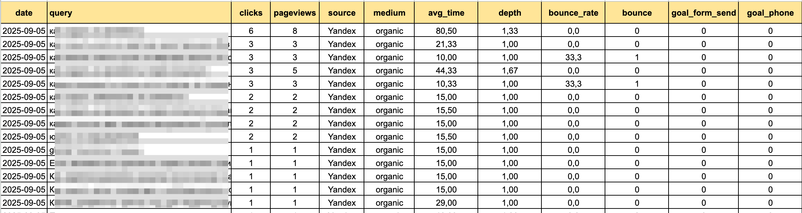
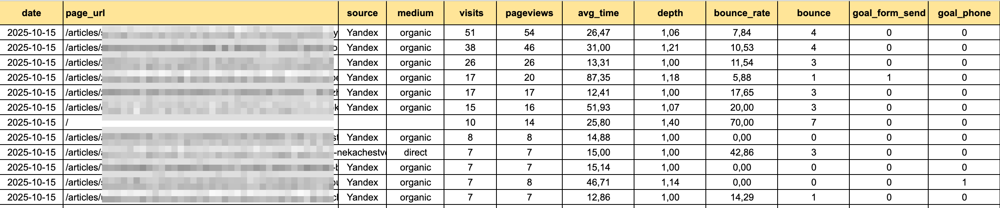
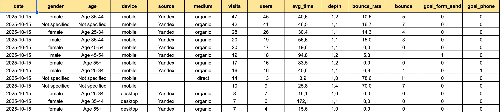

# 📊 Auto SEO-Audit Agent (Yandex Metrica to Google Sheets)

Автоматизированная система сбора аналитических данных. Агент самостоятельно выгружает ключевые показатели эффективности из Яндекс.Метрики и структурирует их в Google Sheets для ежедневного SEO-мониторинга.

## 🚀 Секретный соус

### ❓ Проблема (The Pain)
Раньше на сбор ежедневной отчетности по SEO (визиты, отказы, глубина просмотра) уходило до **1 часа рабочего времени**. Приходилось вручную заходить в кабинеты аналитики, выгружать отчеты и сводить их в одну таблицу, что часто приводило к ошибкам в данных.

### 💡 Решение (The Solution)
Теперь этот агент выполняет всю работу за **10 секунд**. Он автоматически обращается к API Яндекс.Метрики, фильтрует нужные сегменты и мгновенно обновляет вашу Google-таблицу. Больше никакой рутины — только чистая аналитика.

### 📈 Результат (The Result)
- **Экономия времени:** ~20 часов в месяц.
- **Точность:** Исключение человеческого фактора при переносе цифр.
- **Скорость:** Отчет готов еще до того, как вы начали рабочий день.

## 🛠 Стек технологий
- **n8n**: Оркестратор воркфлоу.
- **Yandex Metrica API**: Источник данных.
- **Google Sheets API**: Платформа для отчетности.
- **HTTP Request & JSON Transform**: Глубокая очистка и форматирование данных.

## 📦 Инструкция по запуску
1. Скопируйте файл `workflow.json` и импортируйте его в свой n8n.
2. **Настройка данных:**
   - В узле `Set Variables` (или Edit Fields) замените `YOUR_YANDEX_METRICA_ID` на ID вашего счетчика.
   - В узлах Google Sheets выберите свои Credentials и укажите ID вашей таблицы в поле `YOUR_SPREADSHEET_ID`.
3. Запустите воркфлоу кнопкой **Execute Workflow**.

## 📸 Галерея

---
*Разработал: [SerVoskanyan](https://github.com/SerVoskanyan)* *Проект для автоматизации маркетинговой отчетности и SEO-анализа.*
